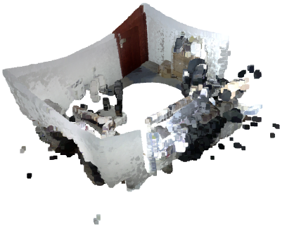
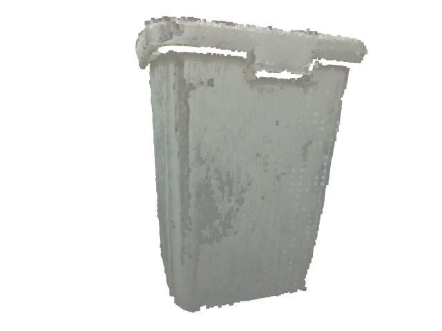

# Orbbec Reconstruction Toolkit

A practical C++ point-cloud workflow for Orbbec capture, object extraction, denoising, registration, and visualization.

**Tested on:** Validated on **BPI-OM7**, an integrated AI 3D vision platform consisting of the **BPI-M7** and **ORBBEC Gemini 2**, running **Ubuntu 24.04**.
## 1. What This Repository Does

This repository provides several standalone executables that can be chained as a pipeline:

1. Capture colored point clouds from Orbbec camera (`sample_data`)
2. Extract near-front object region (`filter_object`)
3. Remove isolated noise clusters (`filter_isolated_clouds`)
4. Register multi-view clouds into one merged model (`main`)
5. Visualize point-cloud files (`cloud_point_visualization`)

## 2. Build Requirements

- CMake >= 3.16
- C++14 compiler (GCC or Clang)
- Open3D (CMake package)  
  On some platforms (especially ARM64), Open3D needs to be built from source.  
  
  ### Build Open3D from Source


  1. Clone repository
      ```bash
      git clone https://github.com/isl-org/Open3D.git
      cd Open3D
      ```
  2. Install dependencies (Ubuntu only)
      ```bash
      util/install_deps_ubuntu.sh
      ```
  3. Build
      ```bash
        mkdir build
        cd build
        cmake ..
        make -j$(nproc)
      ```
      Note: If you encounter an error ：
      ```diff
        CMake Error at 3rdparty/find_dependencies.cmake:1407 (find_library):

        Could not find CPPABI_LIBRARY using the following names: c++abi

        Call Stack (most recent call first):

        CMakeLists.txt:553 (include)

      ```

        try installing the C++ ABI library and rebuilding Open3D with the following commands:
      ```bash
        sudo apt update
        sudo apt install clang libc++-dev libc++abi-dev
      ```
      then build again with:
      ```bash
        rm -rf CMakeCache.txt CMakeFiles/
        cmake .. 
        make -j$(nproc)
      ```
  4. Install
      ```bash
      make install
      ```
  
  Compilation guide:  
  
  [Open3D Compilation Guide](https://www.open3d.org/docs/latest/compilation.html)  

  Project repository:  
  [Open3D GitHub Repository](https://github.com/isl-org/Open3D)
- Orbbec SDK (required for `sample_data` capture tool)

  Install from release packages:  [OrbbecSDK Releases](https://github.com/orbbec/OrbbecSDK_v2/releases)  

  ### Install OrbbecSDK on Ubuntu:
  ```bash
  dpkg -i /path/to/OrbbecSDK_*.deb
  ```
  For source build and documentation:  [OrbbecSDK GitHub Repository](https://github.com/orbbec/OrbbecSDK)

  After installing OrbbecSDK, you can test the camera using the official viewer tool:

  ### OrbbecViewer (Official camera viewer)

  Orbbec provides an official visualization tool **OrbbecViewer** for testing camera streams.
  [Download from releases](https://github.com/orbbec/OrbbecSDK/releases),
  [Usage documentation](https://github.com/orbbec/OrbbecSDK/blob/main/doc/OrbbecViewer/English/OrbbecViewer.md),
  [OrbbecViewer introduction video](.assets/orbbecviewer_overview.mp4) 

## 3. Build

```bash
git clone https://github.com/XuYaot/orbbec_reconstruction_toolkits.git
cd /path/to/orbbec_reconstruction_toolkits
mkdir -p build
cd build
cmake ..
make -j8
```

## 4.Quick Start
If you want to quickly test the registration pipeline without capturing your own data, you can use the provided example datasets.
Download example datasets
## 4.1 `Downloaded datasets`
The provided example datasets are simplified to reduce download size and allow quick testing of the reconstruction pipeline.

You can also download the [full datasets](https://drive.google.com/file/d/1iHaWeYVJph_TUsMppKx7KwAqz_UGgx_I/view?usp=drive_link)
if you need the original captures with more frames and higher completeness.
Place the downloaded files into the `data/` directory of the project so that the structure becomes:
```text
orbbec_reconstruction_toolkits/
├── data/
│    ├── room_data/
│    │   └── raw_data/
│    │       ├── RoomPoints_0.ply
│    │       ├── RoomPoints_1.ply
│    │       └── ...
│    └── object_data/
│         └── filtered_data/
│            ├── data_0.ply
│            ├── data_1.ply
│            └── ...
├── src/
│    └── main.cpp
     ├── sample_data.cpp
     └── ...
```

## 4.2 Run registration on the room dataset (coarse voxel size)

```bash
cd build
./main --voxel_size=0.015 \
       --input_data_dir=../data/room_data/raw_data \
       --file_prefix=RoomPoints_ \
       --result_dir=../data/room_data/result
```
The merged point cloud will be saved as ../data/room_data/result/registered_cloud.ply.

### demonstration video:
[Room Reconstruction Demonstration](.assets/offline_reconstruction.mp4)
## Visualization result: ##


## 4.2 `Run registration on the object dataset (finer voxel size)`

```bash
./main --voxel_size=0.005 \
       --input_data_dir=../data/object_data/filtered_data \
       --file_prefix=data_ \
       --result_dir=../data/object_data/result
```
The merged point cloud will be saved as ../data/object_data/result/registered_cloud.ply.

## Visualization result: ##


## 4.3 `Visualize a resulting point cloud`

```bash
./cloud_point_visualization ../data/room_data/result/registered_cloud.ply
```

## 5. Executables

### 5.1 `sample_data`
Capture point clouds from Orbbec device.

Usage:

```bash
./sample_data manual [raw_data_dir]
./sample_data timer <interval_ms> [raw_data_dir]
./sample_data --help
```

Behavior:

- `manual`: press `R` or `r` to save one point cloud, press `ESC` to exit
- `timer`: save one point cloud every `interval_ms` milliseconds
- output naming format: `data_0.ply`, `data_1.ply`, ...

### demonstration video:
[Data Sampling Demonstration](.assets/online_reconstruction.mp4)

### 5.2 `filter_object`
Batch object extraction from a directory of point-cloud files.

Usage:

```bash
./filter_object [options]
```

Common options:

- `--depth-threshold <meters>`: keep points in `[min_z, min_z + threshold]`
- `--color <R G B threshold>`: optional color-distance filtering
- `--cluster <eps min_points>`: optional DBSCAN and keep largest cluster
- `--input-dir <path>`
- `--output-dir <path>`
- `--ext <extension>`
- `--threads <n>`
- `-h, --help`

Example:

```bash
./filter_object --input-dir ../data/object_data/raw_data --output-dir ../data/object_data/filtered_data --depth-threshold 0.6 --cluster 0.03 20 --threads 4
```

---

### 5.3 `filter_isolated_clouds`
Remove small isolated clusters for all clouds in a directory.

Usage:

```bash
./filter_isolated_clouds <input_dir> [--eps=0.02] [--min_points=20] [--min_cluster_size=200] [--output_dir=<path>] [--inplace]
```

Notes:

- `--inplace` overwrites original files
- without `--inplace`, outputs are written to `--output_dir` or default output directory

Example:

```bash
./filter_isolated_clouds ../data/object_data/filtered_data --eps=0.02 --min_points=20 --min_cluster_size=200 --inplace
```

---

### 5.4 `main`
Register a sequence of indexed point clouds and output merged cloud.

Usage:

```bash
./main [--key=value ...]
```

Input file naming rule:

- file path pattern: `<input_data_dir>/<file_prefix><index><file_ext>`
- example: `../data/object_data/filtered_data/data_0.ply`

Important options:

- `--input_data_dir=PATH`
- `--result_dir=PATH`
- `--file_prefix=STR` (default: `data_`)
- `--file_ext=EXT` (default: `.ply`)
- `--start_index=N`
- `--end_index=N` (`-1` means auto-stop)
- `--method=feature_matching|fgr`
- `--voxel_size=FLOAT`
- `--distance_multiplier=FLOAT`
- `--max_iterations=N`
- `--confidence=FLOAT`
- `--mutual_filter=0|1`
- `--merge_voxel_size=FLOAT`
- `--merge_max_points=N`
- `--merge_guard_voxel_start=FLOAT`
- `--outlier_nb_neighbors=N`
- `--outlier_std_ratio=FLOAT`
- `--visualize=0|1`
- `-h, --help`

Output:

- merged point cloud path: `<result_dir>/registered_cloud.ply`

Example:

```bash
./main --input_data_dir=../data/object_data/filtered_data --result_dir=../data/object_data/result --file_prefix=data_ --start_index=0 --end_index=30 --voxel_size=0.0015 --visualize=1
```

---

### 5.5 `cloud_point_visualization`
View one point-cloud file interactively.

Usage:

```bash
./cloud_point_visualization <point_cloud_path>
./cloud_point_visualization --help
```

Example:

```bash
./cloud_point_visualization ../data/object_data/result/registered_cloud.ply
```

## 6. Recommended Workflow

## 6.1 `Capture`

```bash
./sample_data manual ../data/object_data/raw_data
```

## 6.2 `Object extraction`

```bash
./filter_object --input-dir ../data/object_data/raw_data --output-dir ../data/object_data/filtered_data --depth-threshold 0.6 --cluster 0.03 20
```

## 6.3 `Optional noise cleanup`

```bash
./filter_isolated_clouds ../data/object_data/filtered_data --inplace
```

## 6.4 `Registration`

```bash
./main --input_data_dir=../data/object_data/filtered_data --result_dir=../data/object_data/result --file_prefix=data_ --start_index=0 --end_index=-1
```

## 6.5 `Visualization`

```bash
./cloud_point_visualization ../data/object_data/result/registered_cloud.ply
```

## 7. Troubleshooting

- `Need at least 2 point-cloud files, found: 0`
  - check `--input_data_dir`
  - check `--file_prefix` / `--file_ext` naming rule
  - verify at least two files match pattern

- `Unknown key: ...` in `main`
  - `main` requires `--key=value` format

- `Input directory does not exist`
  - use absolute paths or verify current working directory

- Viewer opens but cloud looks wrong
  - inspect one raw cloud first with `cloud_point_visualization`
  - tune extraction thresholds in `filter_object`

## Related Docs

- Pipeline details: [reconstruction.md](docs/reconstruction.md)
- Developer extension guide: [developer.md](docs/developer.md)
- Orbbec SDK usage details: [orbbecsdk.md](docs/orbbecsdk.md)
- Open3D algorithms and build notes: [open3d.md](docs/open3d.md)
- High-level architecture: [overview.md](docs/overview.md)